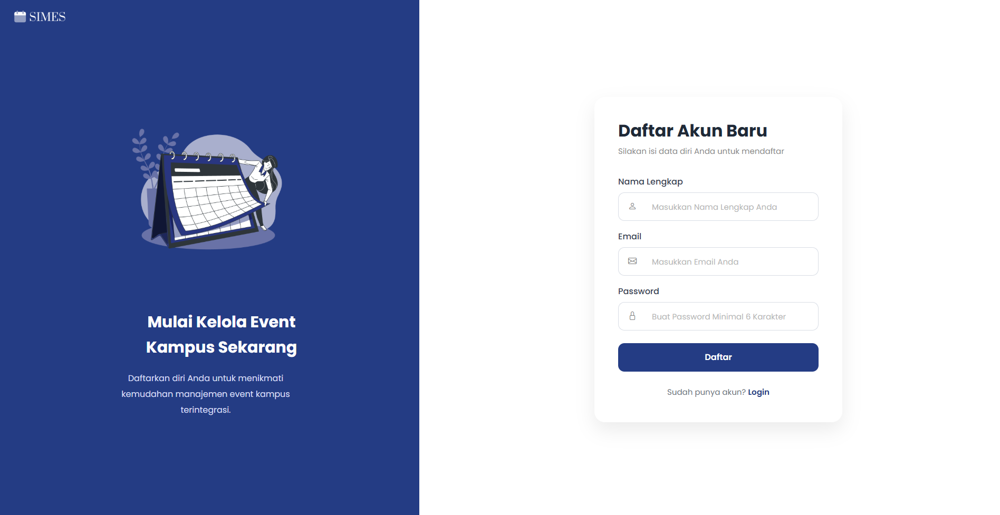
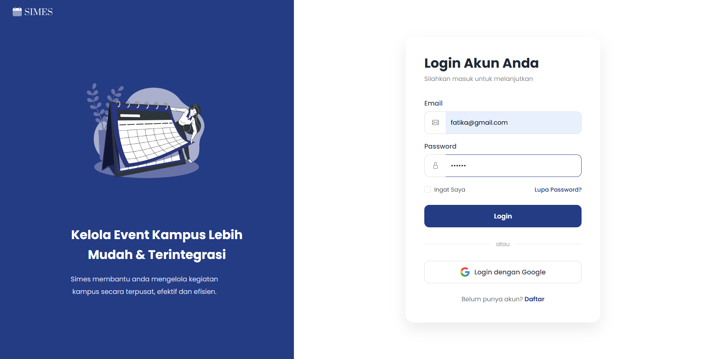
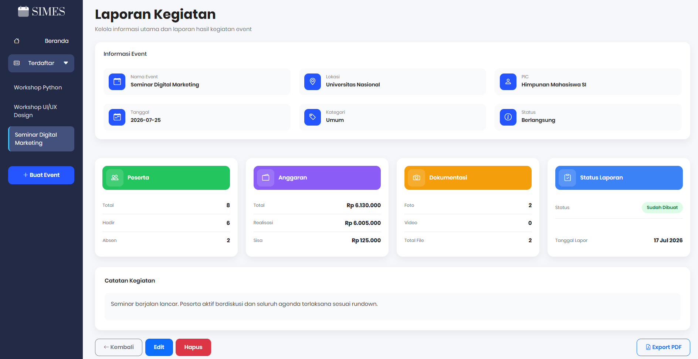
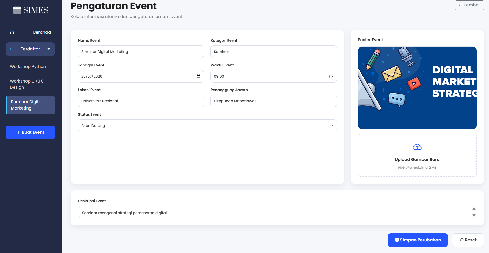

# SIMES - Sistem Informasi Manajemen Event Kampus

SIMES merupakan aplikasi berbasis web yang dikembangkan menggunakan PHP Native dan MySQL untuk membantu pengelolaan kegiatan kampus secara terpusat.

## Fitur

- Login & Register
- Dashboard Utama
- Dashboard Monitoring
- Manajemen Event
- Manajemen Peserta
- Import Data Peserta (CSV)
- Manajemen Anggaran
- Dokumentasi Event
- Laporan Event

## Teknologi

- PHP Native
- MySQL
- Bootstrap 5
- Bootstrap Icons
- HTML5
- CSS3
- JavaScript

## Struktur Project

```
simes/
│
├── assets/                 # CSS, JavaScript, gambar, template, dan file upload
│   ├── css/
│   ├── img/
│   ├── js/
│   ├── templates/
│   └── uploads/
│
├── auth/                   # Login & autentikasi
├── budgets/                # Modul manajemen anggaran
├── config/                 # Konfigurasi aplikasi
│   └── database.php
│
├── DATABASE/               # File database (.sql)
├── documentations/         # Dokumentasi kegiatan
├── events/                 # Modul event
├── includes/               # Header, footer, sidebar, dll.
├── participants/           # Modul peserta
├── reports/                # Modul laporan
├── screenshots/            # Screenshot aplikasi
│
├── .gitignore
├── beranda.php
├── dashboard.php
├── dashboardmonitoring.php
└── README.md
```

## Instalasi

1. Clone repository

```
git clone https://github.com/fatikayezaa/SIMES.git
```

2. Pindahkan folder ke

```
xampp/htdocs/
```

3. Import database

```
database/simes_db.sql
```

4. Atur koneksi database pada

```
config/database.php
```

5. Jalankan Apache dan MySQL melalui XAMPP.

6. Buka

```
http://localhost/simes/beranda.php
```

## Akun

Silakan melakukan registrasi melalui halaman Register.

## Screenshot

### Registrasi



### Login



### Beranda


### Dashboard Utama


### Dashboard Monitoring


### Peserta


### Budget


### Dokumentasi


### Laporan



### Pengaturan Event



## Author
```
KKelompok 3
Mata Kuliah Manajemen Proyek
Universitas Nasional
2026
```