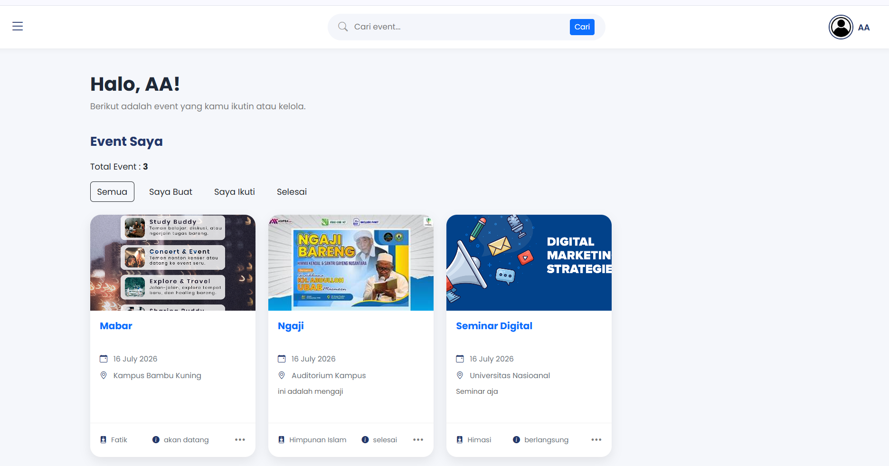
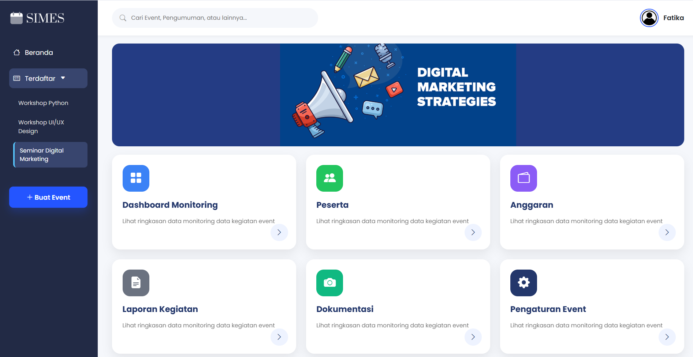
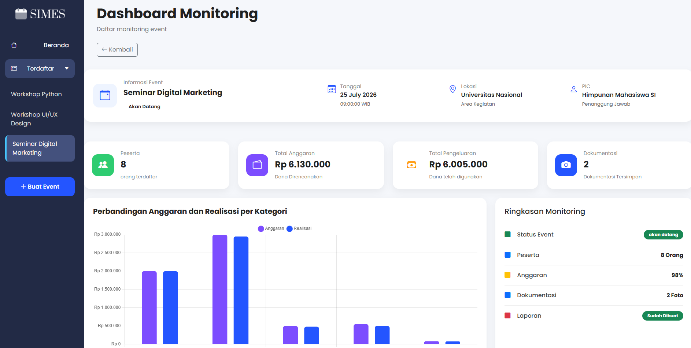
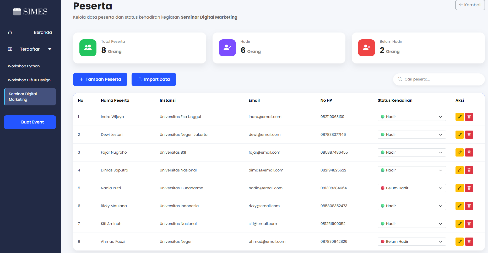
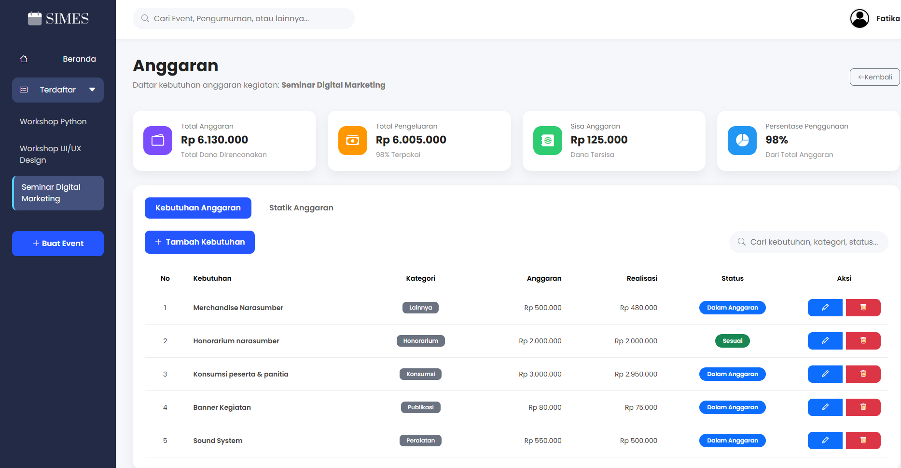
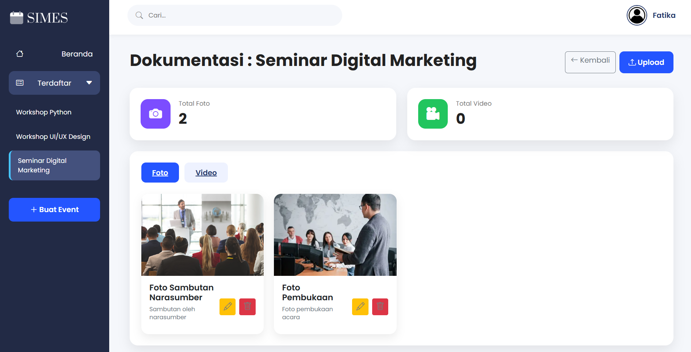
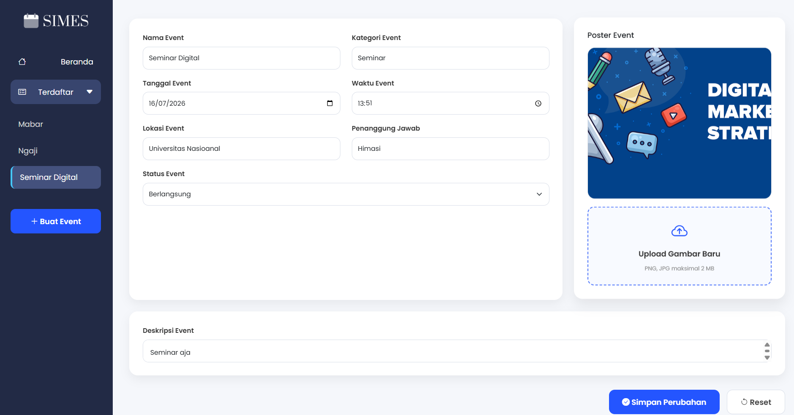

# SIMES - Sistem Informasi Manajemen Event Kampus

SIMES merupakan aplikasi berbasis web yang dikembangkan menggunakan PHP Native dan MySQL untuk membantu pengelolaan kegiatan kampus secara terpusat.

## Fitur

- Login & Register
- Dashboard
- Manajemen Event
- Manajemen Peserta
- Import Data Peserta (CSV)
- Dokumentasi Event
- Laporan Event

## Teknologi

- PHP Native
- MySQL
- Bootstrap 5
- Bootstrap Icons
- HTML5
- CSS3
- JavaScript

## Struktur Project

```
simes/
│
├── assets/
│   ├── css/
│   ├── img/
│   └── js/
│
├── auth/
├── config/
├── database/
├── documentations/
├── events/
├── includes/
├── participants/
├── reports/
│
├── beranda.php
├── index.php
└── README.md
```

## Instalasi

1. Clone repository

```
git clone https://github.com/username/simes.git
```

2. Pindahkan folder ke

```
xampp/htdocs/
```

3. Import database

```
database/simes_db.sql
```

4. Atur koneksi database pada

```
config/database.php
```

5. Jalankan Apache dan MySQL melalui XAMPP.

6. Buka

```
http://localhost/simes
```

## Akun

Silakan melakukan registrasi melalui halaman Register.

## Screenshot

### Beranda



### Dashboard Utama



### Dashboard Monitoring



### Peserta



### Budget



### Dokumentasi



### Laporan


### Pengaturan Event



## Author

Kelompok 3 - Manajemen Proyek
Universitas Nasional